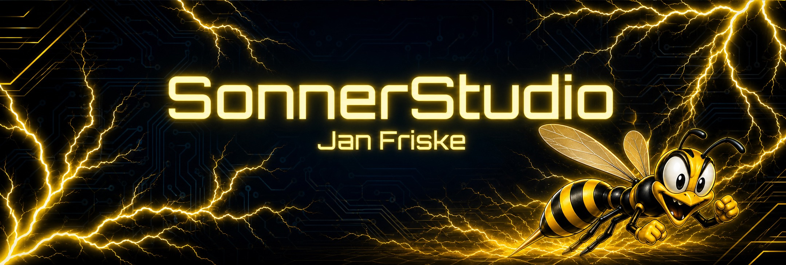
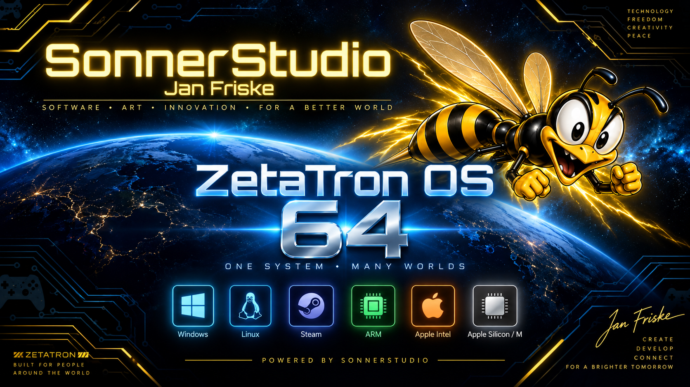

# ZetaTron-OS-64

  

---

##  Übersicht (Deutsch)
ZetaTron-OS-64 ist ein fortschrittliches 64-Bit-Betriebssystemprojekt, das von SonnerStudio entwickelt wird. Unser Maskottchen, die Hornisse ZetaTron, repräsentiert die Geschwindigkeit und Präzision unseres Systems.

### Mission und Ziel
Das ultimative Ziel von ZetaTron-OS-64 ist es, eine universelle, vereinheitlichte Plattform zu schaffen. Es ist so konzipiert, dass es Software von **SonnerStudio**, **Windows**, **macOS**, **Android** und verschiedenen **Linux**-Distributionen nativ innerhalb eines einzigen Betriebssystems nahtlos ausführt.

### Lizenz
Dieses Projekt ist proprietär und Closed-Source. Alle Rechte sind SonnerStudio und Jan Friske vorbehalten. Details findest du in der [LICENSE.md](LICENSE.md).

---

##  Overview (English)
ZetaTron-OS-64 is an advanced 64-bit operating system project being developed by SonnerStudio. Our mascot, the hornet ZetaTron, represents the speed and precision of our system.

### Mission and Goal
The ultimate goal of ZetaTron-OS-64 is to create a universal, unified platform. It is designed to seamlessly run software from **SonnerStudio**, **Windows**, **macOS**, **Android**, and various **Linux** distributions natively within a single operating system.

### License
This project is proprietary and closed-source. All rights are reserved by SonnerStudio and Jan Friske. See the [LICENSE.md](LICENSE.md) file for details.
